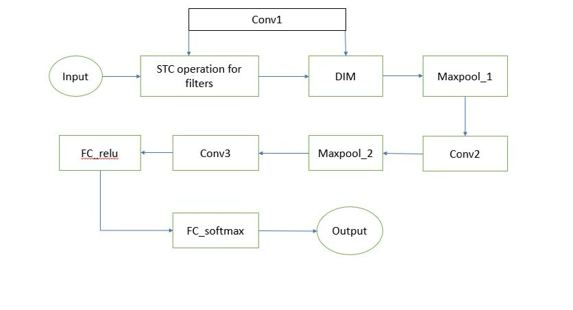
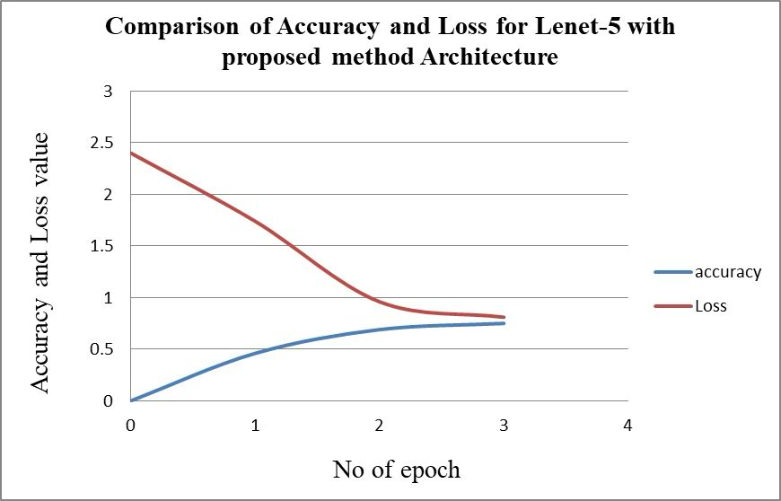

# Optimized Implementation of Convolutional Neural Networks (CNN) 🧠

## 📌 Project Overview
This project focuses on the **optimization of Convolutional Neural Networks (CNNs)** using **Sparse Ternary Connect (STC)** and **Dual Indexing Module (DIM)** techniques.  
The aim was to **reduce computational cost and memory usage** without significant loss of accuracy.  
Experiments were performed on **Single-Layer CNN, Two-Layer CNN, and LeNet-5 architectures**, evaluated on the **MNIST dataset**.

---

## 🚀 Key Contributions
- **Sparse Ternary Connect (STC):** Reduced unnecessary multiplications by pruning weights to {-1, 0, +1}, lowering time complexity.  
- **Dual Indexing Module (DIM):** Efficient handling of sparse activations and weights through dual indexing, minimizing alignment overhead.  
- **Hybrid STC + DIM:** Combined both techniques to balance speed and accuracy.  
- **Result:** Achieved **35.22% reduction in computation time** for **LeNet-5** compared to the baseline CNN, while maintaining comparable accuracy.

---

## 🛠️ Tech Stack
- **Languages:** Python  
- **Frameworks/Libraries:** NumPy, Matplotlib  
- **Dataset:** MNIST Handwritten Digits  
- **Models:** Single Layer CNN, Two Layer CNN, LeNet-5  

---

## 📊 Experimental Results
| Architecture | Approach | Accuracy (%) | Time (secs) | % Reduction (vs. Baseline) |
|--------------|----------|--------------|-------------|-----------------------------|
| Single Layer | Original | 84 | 151 | - |
|              | STC      | 77 | 106 | 37.7% |
|              | DIM      | 84 | 148 | 55.4% |
|              | **STC + DIM** | 81 | 66 | 56.29%|
| Two Layer    | Original | 77 | 726 | - |
|              | STC      | 72 | 239 | 14.2% |
|              | DIM      | 75 | 297 | 31.0% |
|              | **STC + DIM** | 81 | 205 | 71.76%|
| LeNet-5      | Original | 81 | 1067 | - |
|              | STC      | 73 | 749 | 7.7% |
|              | DIM      | 75 | 1106 | 37.5% |
| **LeNet-5**  | **STC + DIM** | ~75 | ~690 | **35.2%** |

> ✅ **Observation:** While STC alone reduced time but lowered accuracy, and DIM maintained accuracy but added overhead, the **combined STC+DIM on LeNet-5 achieved the best trade-off**.

---

## 🖥️ Images  
### Model Architecture

### Graphs

---

## 🔮 Future Scope
- Apply optimized CNNs to **Computer Vision tasks** like object detection, scene labeling, and action recognition.  
- Extend methods to **NLP and speech recognition** by adapting sparsity techniques.  
- Explore **Transformer-CNN hybrids** for low-resource AI models.  

---

## 📖 References
- C. Jin, H. Sun, S. Kimura. *"Sparse ternary connect: Convolutional neural networks using ternarized weights with enhanced sparsity."* ASP-DAC, 2018. [DOI:10.1109/ASPDAC.2018.8297304](https://doi.org/10.1109/ASPDAC.2018.8297304)  
- C. Lin, B. Lai. *"Supporting compressed-sparse activations and weights on SIMD-like accelerator for sparse CNNs."* ASP-DAC, 2018. [DOI:10.1109/ASPDAC.2018.8297290](https://doi.org/10.1109/ASPDAC.2018.8297290)  
- MNIST Dataset: [https://www.kaggle.com/datasets/hojjatk/mnist-dataset](https://www.kaggle.com/datasets/hojjatk/mnist-dataset)]

---

## 👤 Author
**Aishwarya Joshi**  
📍 Bennett University and LeadingIndia.AI (Deep Learning Intern, Remote, May–June 2020)  
[LinkedIn](https://www.linkedin.com/in/aishwarya-j-822999188) | [GitHub](https://github.com/Aishwarya-Joshi11)
